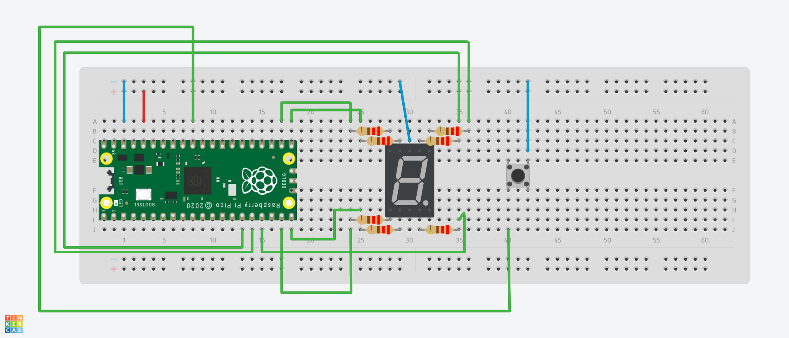

# DISPLAY DE CICLOS DE LAVADO - Panel de lavadora

## Implementación del código
El código está escrito en lenguaje C.

La función del código es controlar un microcontrolador Raspberry Pi Pico W y cambiar la velocidad de la secuencia o animación del display de 7 segmentos dependiendo del ciclo de lavado seleccionado.

Son 3 velocidades diferentes.
- **Ciclo Normal**
- **Ciclo Delicado**
- **Ciclo Rápido**

## Materiales que se necesitaron para implementar el prototipo:
1. Display de 7 segmentos cátodo común x1
2. Botones DIL Push x1
3. Resistencias de 220 Ohms (recomendado) x7
4. Cables Jumper Tipo Macho-Macho x12
5. Raspberry Pi Pico W
6. Protoboard x1

*EXPLICACIÓN*:
Display de 7 segmentos:
```
  --A--
  F   B
  --G--
  E   C
  --D--
```

## Funcionalidades

1. El botón controla la secuencia para los ciclos de lavado. Realiza una secuencia en "S".
```
  --A--    -- --    -- --    -- --    -- --
           F   
  -- -- -> -- -- -> --G-- -> -- -- -> -- --
                                 C
  -- --    -- --    -- --    -- --    --D--
```

2. En el monitor serial se muestra un mensaje que indica que ciclo de lavado se ha seleccionado.
```
Ciclo seleccionado: 1 - Ciclo Normal
Ciclo seleccionado: 2 - Ciclo Delicado
Ciclo seleccionado: 3 - Ciclo Rápido
```

## Ejemplo de ensamble del prototipo



NOTA: Este ejemplo y la imágen del prototipo simula las secuencia sin el temporizador. Las entradas GPIO y la forma de alambrar el prototipo dependerán de cómo se integren las demás funcionalidades del panel de la lavadora.

## Instalación y Uso

1. Clona este repositorio en tu dispositivo.
2. Conecta los componentes a la Raspberry Pi Pico W y a la protoboard según el esquema de conexión proporcionado.
3. Compila y carga el código en la Raspberry Pi Pico W.
4. Presiona cualquier botón y la secuencia correspondiente se mostrará.
5. Oprime otro botón diferente para cambiar de secuencia (es posible que necesites mantener oprimido el botón por uno o dos segundos para que se realice el cambio.)