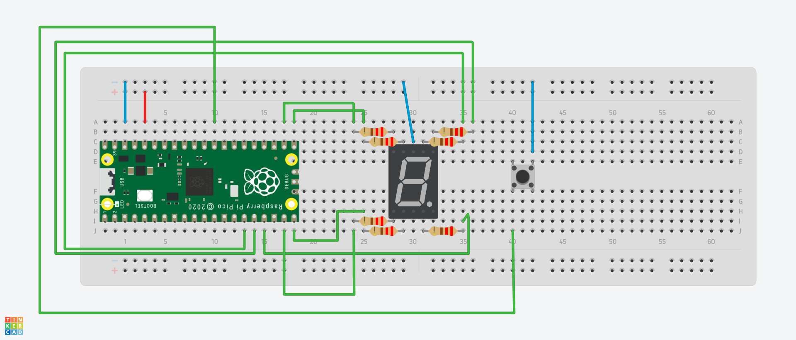

# DISPLAY DE FASES DE LAVADORA - Panel de lavadora

## Implementación del código
El código está escrito en lenguaje C.

La función del código es controlar un microcontrolador Raspberry Pi Pico W y cambiar la secuencia o animación del display de 7 segmentos dependiendo del botón que se oprima.

Son 3 secuencias diferentes.
- **Fase de lavado**: Secuencia en cascáda.
- **Fase de enjuague**: Secuencia en "8" o infinito.
- **Fase de centrifugado**: Secuencia en círculo.

## Materiales que se necesitaron para implementar el prototipo:
1. Display de 7 segmentos ánodo común x1
2. Botones DIL Push x3
3. Resistencias de 220 Ohms (recomendado) x7
4. Cables Jumper Tipo Macho-Macho x15
5. Raspberry Pi Pico W
6. Protoboard x1

*EXPLICACIÓN*:
Display de 7 segmentos:
```
  --A--
  F   B
  --G--
  E   C
  --D--
```

## Funcionalidades

1. El primer botón controla la secuencia para la fase de lavado. Realiza una secuencia como en cascáda.
```
  --A--    -- --    -- --    -- --
           F   B
  -- -- -> -- -- -> -- -- -> -- --
                    E   C
  -- --    -- --    -- --    --D--
```
2. El segundo botón controla la secuencia para la fase de enjuague. Realiza una secuencia en "8" o infinito.
```
  --A--    -- --    -- --    -- --    -- --    -- --    -- --    -- --
               B                                                 F
  -- -- -> -- -- -> --G-- -> -- -- -> -- -- -> -- -- -> --G-- -> -- --
                             E                     C
  -- --    -- --    -- --    -- --    --D--    -- --    -- --    -- --
```
3. El tercer botón controla la secuencia para la fase de centrifugado. Realiza una secuencia en círculo.
```
  --A--    -- --    -- --    -- --    -- --    -- --
               B                               F
  -- -- -> -- -- -> -- -- -> -- -- -> -- -- -> -- --
                        C             E
  -- --    -- --    -- --    --D--    -- --    -- --
```
## Ejemplo de ensamble del prototipo



NOTA: Este ejemplo y la imágen del prototipo simulan las secuencias de las fases sin el temporizador. Las entradas GPIO y la forma de alambrar el prototipo dependerán de cómo se integren las demás funcionalidades del panel de la lavadora.

## Instalación y Uso

1. Clona este repositorio en tu dispositivo.
2. Conecta los componentes a la Raspberry Pi Pico W y a la protoboard según el esquema de conexión proporcionado.
3. Compila y carga el código en la Raspberry Pi Pico W.
4. Presiona cualquier botón y la secuencia correspondiente se mostrará.
5. Oprime otro botón diferente para cambiar de secuencia (es posible que necesites mantener oprimido el botón por uno o dos segundos para que se realice el cambio.)