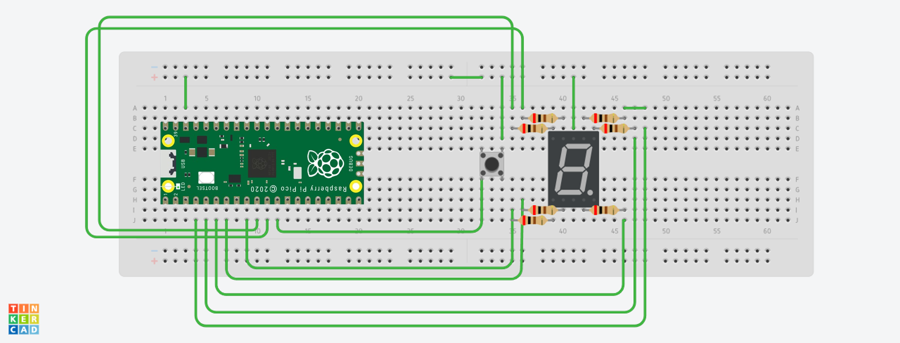

# Control del temporizador del ciclo de lavado

Este proyecto implementa un control del ciclo de lavado para una lavadora. Utiliza un botón conectado a un microcontrolador para controlar el timepo que durará el ciclo de lavado sumado que muestra en la consola el timepo que dura un ciclo de lavado.

## Funcionalidades

- **Aumentar el ciclo de lavado 30 segundos:** Al presionar el botón, el ciclo de lavado aumneta 30 segundos.

## Implementación del Código

El código está escrito en lenguaje C y está diseñado para ser ejecutado en un microcontrolador como la Raspberry Pi Pico.

### Función `main()`

La función principal del programa inicializa los pines GPIO del botón. Y con un bucle permite que cada vez que el boton se oprima se añadan 30 segundos al temporizador. 

## Esquema de Conexión

A continuación se muestra el esquema de conexión del botón al microcontrolador:

## Instalación y Uso

1. Clona este repositorio en tu dispositivo.
2. Conecta el botón al microcontrolador según el esquema de conexión proporcionado.
3. Compila y carga el código en el microcontrolador.
4. Inicia el ciclo de lavado presionando el botón.
5. Para pausar el ciclo, presiona nuevamente el botón. Para reanudar el ciclo, presiona el botón otra vez.

# Botones nivel de agua y temporizador modularizados

## Botón temporizador

El botón temporizador permite controlar el tiempo de un ciclo de lavado, aumentando el tiempo en intervalos de 30 segundos con cada pulsación.

### **Clase: BotónTemporizador**

#### Metodos:
- BotonTemporizador(uint gpio): Constructor de la clase, inicializa el botón temporizador con el GPIO especificado.
- void inicializar(): Inicializa el botón temporizador.
- bool is_pressed(): Verifica si el botón está presionado.
- void aumentar_tiempo(int& minutos, int& segundos): Aumenta el tiempo del temporizador en 30 segundos.

## Botón Nivel de Agua

El botón nivel de agua permite seleccionar entre tres niveles de agua: mínimo, medio y máximo.

### **Clase: BotónNivelAgua**

#### Metodos:
- BotonNivelAgua(uint gpio): Constructor de la clase, inicializa el botón nivel de agua con el GPIO especificado.
- void inicializar(): Inicializa el botón nivel de agua.
- bool is_pressed(): Verifica si el botón está presionado.
- int get_nivel(): Obtiene el nivel actual de agua (MINIMO, MEDIO, MAXIMO).

