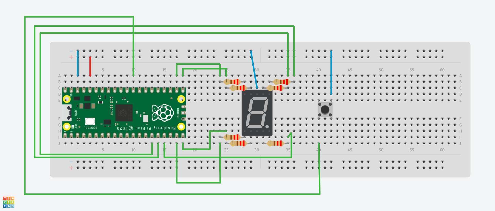

# DISPLAY DE FASES DE LAVADORA - Panel de lavadora

## Implementación del código
El código está escrito en lenguaje C++.

La función del código es controlar un microcontrolador Raspberry Pi Pico W y cambiar la secuencia o animación del display de 7 segmentos dependiendo del botón que se oprima.

## Archivos
- [boton_fases.cc](boton_fases.cc)

En este archivo, se inicializa la variable estática **delay** utilizada para controlar el tiempo de espera en la ejecución de secuencias. Además, se definen e implementan varios métodos de la clase *BotonFases*.

- [boton_fases.h](boton_fases.h)

La cabecera donde se define la clase *BotonFases*.

- [pin_list.h](../include/pin_list.h)

La cabecera donde se definen las macros de todos los GPIOs del tablero.

- [test.cc](test.cc)

El archivo que contiene la función principal donde se invocan las funciones para seguir la lógica del botón de fases.

## Funciones del código
- `void configurarGPIOs()`
Se encarga de preparar los pines GPIO necesarios para controlar un display de 7 segmentos y un botón en un sistema embebido. Inicia configurando los pines del display como salidas, permitiendo así controlar los segmentos. Luego, configura el pin del botón como entrada, activando una resistencia de pull-up para mantener un estado alto cuando el botón no está presionado. Esta configuración asegura que los dispositivos puedan funcionar correctamente al interactuar con el microcontrolador.


- `void cambiarFase()`
Comprueba si el botón de fases está presionado utilizando la función botonFasesPresionado(). Si detecta que el botón está presionado, esta función cambia la fase actual del ciclo de lavado a la siguiente fase en secuencia. Si la fase actual es 3, volverá a la fase 1, permitiendo así la rotación cíclica entre las fases del ciclo de lavado.


- `void mostrarFase()`
Verifica si la fase actual del ciclo de lavado es diferente de la fase anterior. Si son diferentes, imprime por el monitor serial la fase actual del ciclo de lavado, indicando si corresponde a "Completo", "Lavado", "Enjuague" o "Centrifugado" según el valor de fase_actual. Luego, actualiza la fase anterior para reflejar el cambio realizado. Esta función asegura que solo se imprima la fase actual cuando cambia con respecto a la fase anterior.


- `void ejecutarSecuencia`
Ejecuta una secuencia específica en un display de 7 segmentos según la fase actual del ciclo de lavado. Utiliza un switch para determinar la fase actual y seleccionar la secuencia correspondiente.

  Para la fase 1, la configuración predeterminada (ciclo completo) se ejecuta.
  Para la fase 2, activa y desactiva los segmentos del display según la secuencia secLavar durante un tiempo determinado por la variable **delay**.
  Para la fase 3, realiza una secuencia similar con la variable **secEnjuagar**.
  Para la fase 4, utiliza la secuencia **secCentrifugar**.

Cada secuencia se activa mediante la función gpio_set_mask() y se desactiva después de un periodo de tiempo determinado por **delay** utilizando un bucle for. Este proceso simula la visualización de diferentes etapas del ciclo de lavado en un display de 7 segmentos.


- `bool botonFasesPresionado()`
Verifica si el botón de fases está presionado al leer el estado del pin asociado al botón **BOTON_FASES**. Esta función se utiliza para detectar si se ha presionado el botón de fases desde la última comprobación.

## Secuencias / animaciones del display
*EXPLICACIÓN*:
Display de 7 segmentos:
```
  --A--
  F   B
  --G--
  E   C
  --D--
```

1. La primer secuencia es para la fase completa.
```
  --A--    -- --    -- --    -- --    -- --
                             F   B
  -- -- -> --G-- -> -- -- -> -- -- -> -- --
                                      E   C
  -- --    -- --    --D--    -- --    -- --
```

2. La segunda secuencia es para la fase de lavado. Realiza una secuencia como en cascáda.
```
  --A--    -- --    -- --    -- --
           F   B
  -- -- -> -- -- -> -- -- -> -- --
                    E   C
  -- --    -- --    -- --    --D--
```
3. La tercer secuencia es para la fase de enjuague. Realiza una secuencia en "8" o infinito.
```
  --A--    -- --    -- --    -- --    -- --    -- --    -- --    -- --
               B                                                 F
  -- -- -> -- -- -> --G-- -> -- -- -> -- -- -> -- -- -> --G-- -> -- --
                             E                     C
  -- --    -- --    -- --    -- --    --D--    -- --    -- --    -- --
```
4. La cuarta secuencia es para la fase de centrifugado. Realiza una secuencia en círculo.
```
  --A--    -- --    -- --    -- --    -- --    -- --
               B                               F
  -- -- -> -- -- -> -- -- -> -- -- -> -- -- -> -- --
                        C             E
  -- --    -- --    -- --    --D--    -- --    -- --
```

## Materiales que se necesitaron para implementar el prototipo:
1. Display de 7 segmentos cátodo común x1
2. Botones DIL Push x1
3. Resistencias de 220 Ohms (recomendado) x7
4. Cables Jumper Tipo Macho-Macho x12
5. Raspberry Pi Pico W
6. Protoboard x1

## Ejemplo de ensamble del prototipo



NOTA: Este ejemplo y la imágen del prototipo simulan las secuencias de las fases sin el temporizador. Las entradas GPIO y la forma de alambrar el prototipo dependerán de cómo se integren las demás funcionalidades del panel de la lavadora.

## Instalación y Uso

1. Clona este repositorio en tu dispositivo.
2. Conecta los componentes a la Raspberry Pi Pico W y a la protoboard según el esquema de conexión proporcionado.
3. Compila y carga el código en la Raspberry Pi Pico W.
4. Presiona cualquier botón y la secuencia correspondiente se mostrará.
5. Oprime otro botón diferente para cambiar de secuencia (es posible que necesites mantener oprimido el botón por uno o dos segundos para que se realice el cambio.)